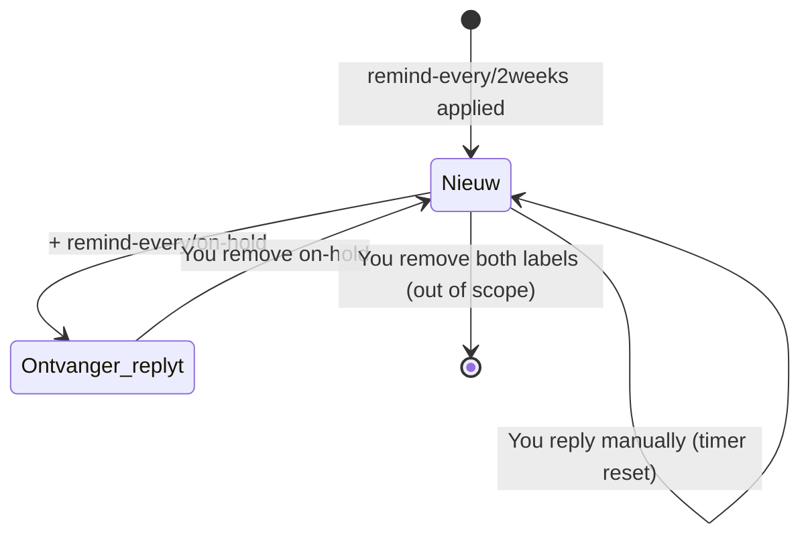

# Gmail Reminder Scripts 🤖📧

Two Google Apps Script projects for automated email reminders via Gmail labels.

---

## 🧪 Preview & Dry-Run Modes

The script has **three ways** to preview what would happen without actually sending:

- **`previewReminders()`** — Logs status of all threads: ⏸ on-hold, 🔴 due now, ⏳ remaining days. Quickest check.
- **`dryRun()`** — Creates Gmail drafts instead of sending. See the exact AI-generated body.
- **`CONFIG.DRY_RUN = true`** — Logs everything, nothing created in Gmail. Full output in Execution log.

**Default:** `CREATE_DRAFTS: true` — all reminders are created as drafts first.
Set `CREATE_DRAFTS = false` only when ready to go live.

### Example

```javascript
// Step 1: check status
previewReminders();

// Step 2: view drafts in Gmail → Drafts
dryRun();

// Step 3: go live
// Edit CONFIG.CREATE_DRAFTS = false in code OR
// just let the trigger run normally
checkReminders(); // actually sends
```

---

## 📦 Projects

### 1. FollowUpReminder — AWV Case Follow-Up

**Purpose:** Automated follow-up of AWV notification cases for the municipality of Merelbeke-Melle.

Scans Gmail for unanswered cases, sends summary digest emails, and escalates stubborn cases to the "big chief".

**Flow:**

```mermaid
flowchart TD
    A[AWV mail arrives in Gmail inbox] --> B[FollowUp/Active label applied (manual or auto)]
    B --> C[Every 6h: checkDigests() / checkEscalations()]
    C --> D[syncLabels() - count reminders, set FollowUp/N label]
    D --> E[collectPending()]
    E --> F{Filter: Older than WAIT_DAYS, not Closed, no reply from recipient, no cross-thread reply}
    F --> G[pending list with thread, subject, ticketCode, reminderCount, sentDate, context]
    G --> H{Split: reminderCount < ESCALATE_AFTER?}
    H -->|Yes| I[toDigest → sendDigest(): summary email to mobiliteit@...]
    H -->|No & not escalated| J[toEscalate → sendEscalation(): separate email to big chief + FollowUp/Escalated label]
    I --> K[Next cycle: escalated threads stay in pending (in digest), no new escalation for already escalated]
    J --> K
```

**✅ After fix:** Escalated threads stay in the digest! They won't be re-escalated, but regular reminder digests continue until the case is closed.

**Labels:** `FollowUp/Active`, `FollowUp/Closed`, `FollowUp/Escalated`, `FollowUp/1` through `FollowUp/N`

**Recipient:** `mobiliteit@merelbeke-melle.be`

---

### 2. LabelReminder — Universal Label Reminders

**Purpose:** Apply a label to **any** email, get an AI reminder after a specified time.

Works on any inbox, not tied to specific recipients. Uses Gemini AI to generate reminders in the correct language (NL/EN).

**Flow:**

```mermaid
flowchart TD
    A[Apply remind-every/2weeks to any email in Gmail] --> B[Every 6h: checkReminders()]
    B --> C[Step 1: autoPauseOnReply()]
    C --> D{For each remind-every/* thread: Has recipient replied? (not Aldo, not AWV system mails)}
    D -->|Yes| E[Apply remind-every/on-hold label ⏸]
    D -->|No| F[Do nothing]
    E --> G[Step 2: Send reminders]
    F --> G
    G --> H{Filter: has remind-every/* label, NOT remind-every/on-hold}
    H --> I[For each active thread: Interval elapsed since last message from Aldo? (manual or auto)]
    I -->|Yes| J[Generate reminder: 1. Detect language (NL/EN), 2. Gemini prompt, 3. Send as threaded reply]
    I -->|No| K[Skip, wait for next check]
```

**Your control:**

| What you do | What happens |
|---|---|
| Recipient replies | `on-hold` auto-applied ⏸ |
| You remove `on-hold` | Resumes on next check ▶️ |
| You add `on-hold` | Reminders stopped |
| You remove `remind-every/2weeks` | Thread out of scope 🗑 |
| You reply manually | Timer resets (last message from Aldo) |

**Supported labels:** `remind-every/1week`, `remind-every/2weeks`, `remind-every/1month`, `remind-every/1year`, etc. (any number + day/week/month/year combination)

**Uses AI** (Gemini → FreeLLMAPI waterfall) for generating personalized reminders.

---

### 1. First-Time Setup (One-Time Only)

**For both projects**, you must configure Script Properties before the scripts can run:

1. Open your project in the Apps Script editor:
   - **LabelReminder**: https://script.google.com/d/1ILoH9E1JGxuG_T-k4fDcJWnvF6Fl8LPBdYD0COerNIk5z6fhknbhYSCw/edit
   - **FollowUpReminder**: https://script.google.com/d/1BC9oGoHqrkQMO6fUIzTT7Hs_X4tRMB4ZOjXUrSUgMwa6NLUJ73GZLT_u/edit

2. Go to **Project Settings** (gear icon) → **Script Properties**

3. Add the following properties:

| Property | Required | Description |
|---|---|---|
| `GEMINI_API_KEY` | ✅ Yes | Comma-separated Gemini API keys for multi-key fallback |
| `FREE_LLM_API_KEY` | ❌ Optional | Self-hosted FreeLLMAPI key (fallback if Gemini fails) |
| `OPENROUTER_API_KEY` | ❌ Optional | OpenRouter API key (3rd-tier fallback) |

4. Save the changes

5. Run the setup function once per project:
```bash
cd ~/dev/06-apps-script-google/LabelReminder
clasp run setup
```

```bash
cd ~/dev/06-apps-script-google/FollowUpReminder
clasp run setup
```

### 2. Initial Test
After setup, verify everything works:
```bash
# LabelReminder
cd LabelReminder && clasp run previewReminders
clasp run dryRun

# FollowUpReminder
cd FollowUpReminder && clasp run previewReminders
clasp run dryRun
```

### 3. Go Live
Once you're satisfied with the drafts, set `CONFIG.CREATE_DRAFTS = false` in the code to send real emails.

---

## ⚙️ Technical Details

**Language:** Google Apps Script (JavaScript V8 runtime)

**APIs:**
- Gmail API (read, labels, send)
- Gemini / FreeLLMAPI (AI via UrlFetchApp)
- Apps Script API (triggers)

**Triggers:** Time-based, every 6 hours (`checkReminders` / `checkDigests` / `checkEscalations`)

---

## 🚀 Local Development & CLI

Scripts are exported from Google Apps Script and live in this repo.
Edit locally, test with clasp, and commit.

### 🔌 Run Functions from the CLI (`clasp run`)

**Quick reference:**

```bash
# From project root
cd ~/dev/06-apps-script-google

# Navigate to project
cd LabelReminder

# Run any function
clasp run dryRun              # Create drafts (test mode)
clasp run previewReminders    # Show status log
clasp run testIrritationCombined  # Test irritation ladder

# View logs
clasp tail-logs --simplified  # Show recent logs
clasp tail-logs --watch       # Watch logs in real-time

# Open in browser
clasp open-script             # Open Apps Script editor
clasp open-logs               # Open Cloud Logging
```

**Important:** The first time you run `clasp run`, you must authorize in the browser:
1. Open: `clasp open-script`
2. Run the function manually (click ▶️ Run)
3. Accept permissions when prompted
4. Then `clasp run` will work

### 📝 Log Files

Logs are automatically saved to `~/dev/06-apps-script-google/logs/` when run from this repository:

```bash
# Check recent logs
cat ~/dev/06-apps-script-google/logs/LabelReminder.log

# Watch logs
tail -f ~/dev/06-apps-script-google/logs/LabelReminder.log
```

### 📊 Label Lifecycle (per thread)



### ⏱ Timing

```mermaid
gantt
    title Trigger Schedule
    dateFormat  HH:mm
    axisFormat  %H:%M
    
    section FollowUpReminder
    checkDigests       :a1, 00:00, 6h
    checkEscalations   :a2, 00:00, 6h
    
    section LabelReminder
    checkReminders     :b1, 00:00, 6h
```



---

## About

Gmail reminder scripts: FollowUpReminder (AWV dossier opvolging) + LabelReminder (universele AI herinneringen via labels)

### Resources

[Readme](https://github.com/Aldo-f/script.google#readme-ov-file)

[Activity](https://github.com/Aldo-f/script.google/activity)

### Stars

**0** stars

### Watchers

**0** watching

### Forks

[**0** forks](https://github.com/Aldo-f/script.google/forks)

[Report repository](https://github.com/contact/report-content?content_url=https%3A%2F%2Fgithub.com%2FAldo-f%2Fscript.google&report=Aldo-f+%28user%29)

## Releases

## Packages

## Contributors

## Languages